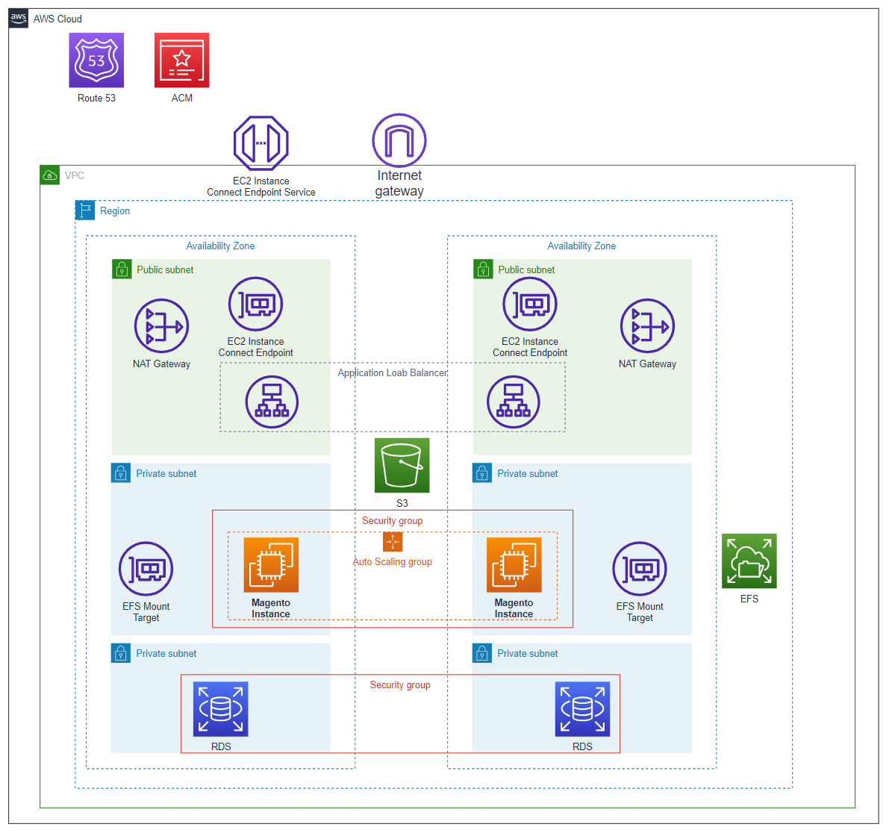

# Arquitetura de Implantação do Magento na AWS

## Visão Geral
Este repositório contém a arquitetura de implantação para executar o Magento, uma plataforma de e-commerce, na Amazon Web Services (AWS). A arquitetura é projetada para ser segura, escalável e resiliente.

## Diagrama da Arquitetura

## Componentes da Arquitetura

### Amazon VPC (Virtual Private Cloud)
- **Descrição**: A Amazon Virtual Private Cloud (Amazon VPC) é uma rede virtual isolada para a execução de recursos da AWS.
- **Configuração**: Uma VPC principal foi criada com duas sub-redes públicas e quatro sub-redes privadas distribuídas em zonas de disponibilidade diferentes. Além de contar com NAT Gateway e algumas tabelas de rotas para a aplicação.

### Auto Scaling Group (ASG)
- **Descrição**: O Auto Scaling Group (ASG) permite escalonar automaticamente instâncias EC2 com base na demanda.
- **Configuração**: O ASG está configurado para manter entre 1 e 4 instâncias EC2 com base na saúde do Load Balancer e utiliza um Launch Template para criar as instâncias.

### Application Load Balancer (ALB)
- **Descrição**: O Application Load Balancer (ALB) distribui o tráfego entre as instâncias EC2.
- **Configuração**: O ALB está configurado para encaminhar o tráfego para um Target Group que inclui as instâncias EC2.

### Amazon Elastic File System (EFS)
- **Descrição**: O Amazon EFS fornece armazenamento de arquivos escalável e compartilhado.
- **Configuração**: Um sistema de arquivos EFS foi criado para armazenar os arquivos da aplicação e é montado em instâncias nas sub-redes privadas.

### Amazon RDS (Relational Database Service)
- **Descrição**: O Amazon RDS é um serviço de banco de dados gerenciado.
- **Configuração**: Um banco de dados MySQL RDS, com o multi AZ habilitado, foi configurado em subnets privadas para armazenar os dados do Magento.

### Instance Connect Endpoint (ICE)
- **Descrição**: O Instance Connect Endpoint (ICE) permite que você se conecte de forma segura às instâncias EC2 usando o AWS Systems Manager Session Manager.
- **Configuração**: ICE foi configurado em sub-redes públicas para facilitar a administração remota.

### Amazon S3
- **Descrição**: O Amazon S3 é um serviço de armazenamento de objetos escalável.
- **Configuração**: Um bucket S3 foi criado para armazenar conteúdo estático, com versionamento habilitado.

### Chave SSH
- **Descrição**: Uma chave SSH foi gerada para autenticação segura nas instâncias EC2.
- **Configuração**: A chave SSH é usada para autenticação SSH (usando o ICE) nas instâncias EC2 e é armazenada de forma segura.

## Melhorias Futuras
- Implementar um sistema de monitoramento e registro para acompanhar o desempenho e o status da infraestrutura.
- Implementar um sistema de backup automatizado para o Amazon RDS e Amazon EFS para garantir a recuperação de dados em caso de falha.
- Criação de um ambiente de desenvolvimento/teste separado para testar alterações antes de implantá-las na produção.
- Políticas de retenção e gerenciamento de logs para registros e eventos relevantes.
- Usar serviços de CDN (Content Delivery Network) para melhorar o desempenho de entrega de conteúdo estático.

## Contribuição
Contribuições são bem-vindas! Se você encontrar algum problema ou quiser sugerir melhorias, sinta-se à vontade para abrir uma issue ou criar um pull request.